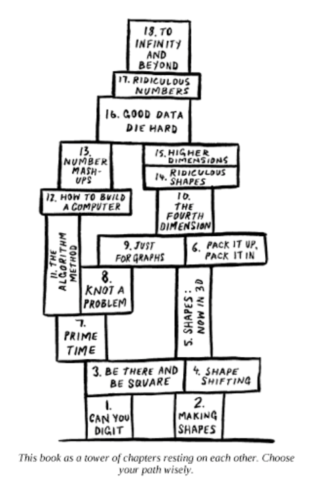

* `tower-of-power.py` - heavily-commented source code that explains what's
  going on here
* `examples/` - various dependency graphs in the BOX file format
* `gallery/` - those examples rendered to SVGs
* `scrape-deps.py` - utility to create BOX files from Homebrew and npm package
  dependency graphs
* `make-gallery.sh` - regenerates the SVGs
